# CogPrime Technical Architecture Documentation

## Executive Summary

CogPrime is a comprehensive Artificial General Intelligence (AGI) system that integrates multiple cognitive architectures including OpenCog Prime, OpenCog Hyperon, and John Vervaeke's Relevance Realization framework. The system is built in Python with PyTorch for neural components and includes a distributed knowledge representation system (AtomSpace) with multiple backend options.

## Technology Stack

### Core Technologies

- **Language**: Python 3.8+ (Primary), Lua 5.3+ (OpenCog implementation)
- **Deep Learning Framework**: PyTorch 2.0+
- **Knowledge Representation**: AtomSpace (Hypergraph database)
- **Distributed Computing**: node9 namespace system, gRPC
- **Memory System**: mem0 with vector search capabilities
- **Vector Databases**: Qdrant, ChromaDB, Pinecone, Milvus, Redis
- **Graph Databases**: Neo4j, py2neo
- **LLM Integration**: OpenAI, Anthropic, Google Generative AI, Cohere, Transformers

### Key Frameworks

1. **OpenCog Prime**: Core cognitive architecture principles
2. **OpenCog Hyperon**: Advanced AGI capabilities
3. **Vervaeke's 4E Cognition**: Embodied, Embedded, Enacted, Extended cognition
4. **SiliconSage**: Integrated AGI architecture (v0-v5 evolution)

## System Architecture Overview

### High-Level System Components

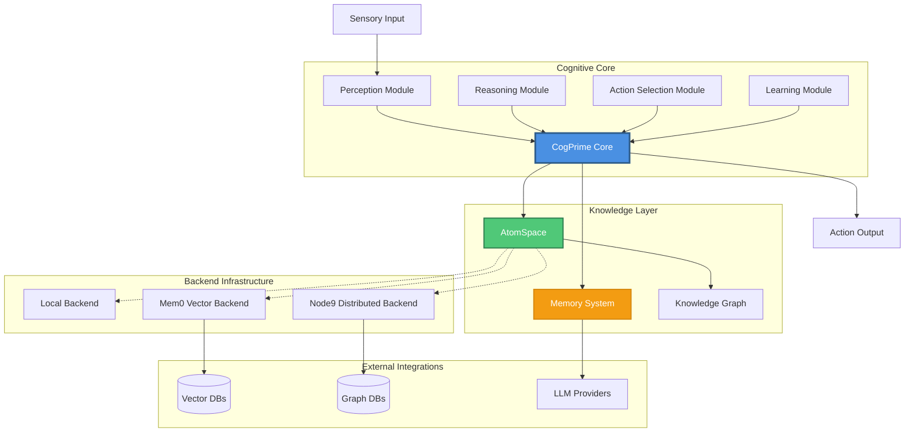

### Cognitive Cycle Data Flow

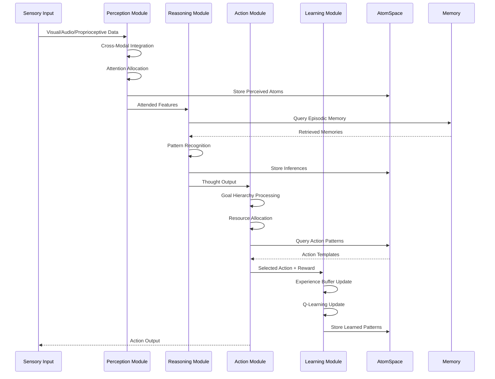

## Core Component Architecture

### 1. CogPrime Core (Cognitive Orchestrator)

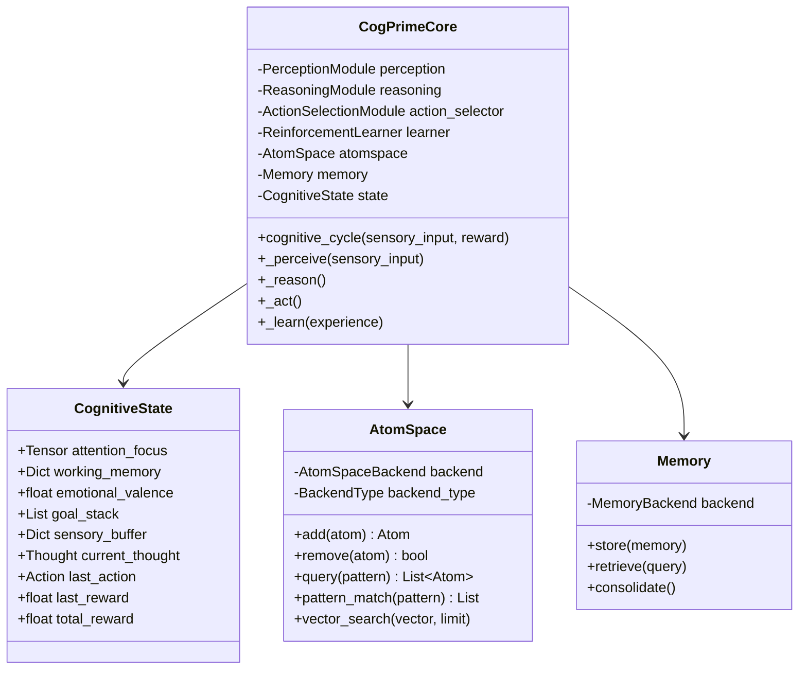

### 2. Perception Module Architecture

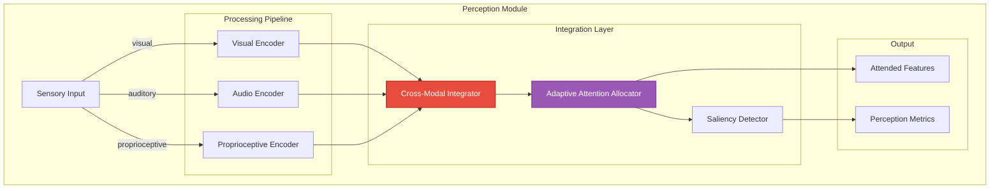

### 3. Reasoning Module Architecture

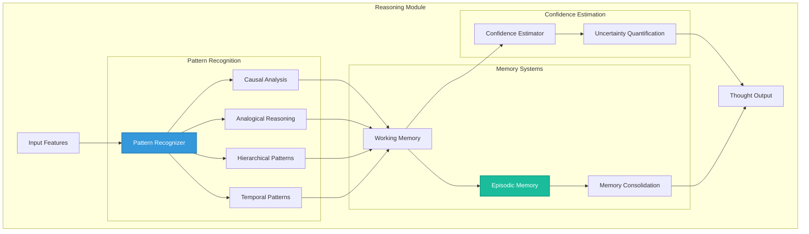

### 4. Action Selection Module Architecture

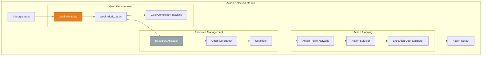

### 5. Learning Module Architecture

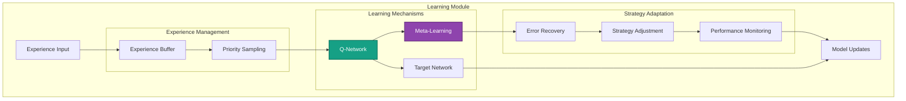

## Knowledge Layer Architecture

### AtomSpace Hypergraph Structure

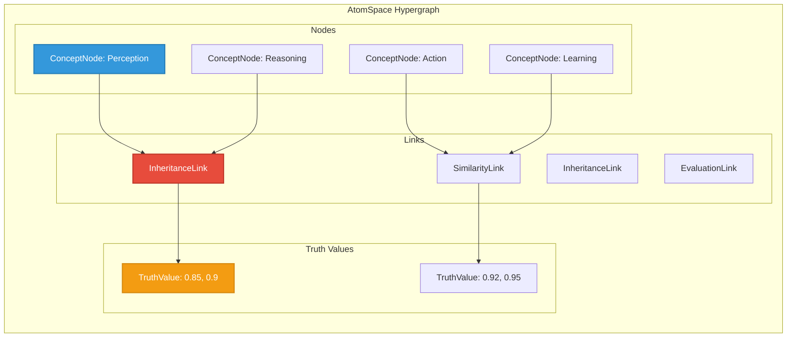

### Backend Architecture

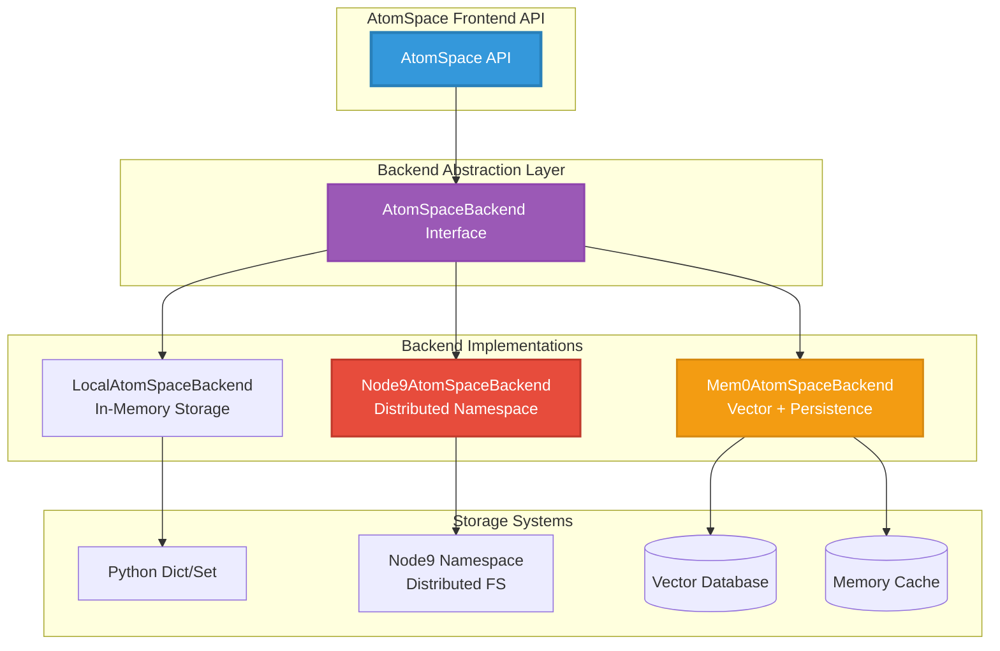

## Integration Boundaries

### External System Integration

```mermaid
graph TB
    subgraph "CogPrime Core System"
        CORE[CogPrime Core]
        AS[AtomSpace]
        MEM[Memory System]
    end
    
    subgraph "Vector Database Layer"
        QDRANT[Qdrant]
        CHROMA[ChromaDB]
        PINECONE[Pinecone]
        MILVUS[Milvus]
        REDIS[Redis]
    end
    
    subgraph "Graph Database Layer"
        NEO4J[Neo4j]
        PY2NEO[py2neo]
    end
    
    subgraph "LLM Provider Layer"
        OPENAI[OpenAI GPT]
        ANTHROPIC[Anthropic Claude]
        GOOGLE[Google Gemini]
        COHERE[Cohere]
        HF[HuggingFace]
    end
    
    subgraph "Embedding Services"
        SENT[Sentence Transformers]
        FAST[FastText]
        TIKTOKEN[TikToken]
    end
    
    MEM --> QDRANT
    MEM --> CHROMA
    MEM --> PINECONE
    MEM --> MILVUS
    MEM --> REDIS
    
    AS --> NEO4J
    AS --> PY2NEO
    
    CORE --> OPENAI
    CORE --> ANTHROPIC
    CORE --> GOOGLE
    CORE --> COHERE
    CORE --> HF
    
    MEM --> SENT
    MEM --> FAST
    MEM --> TIKTOKEN
    
    style CORE fill:#2c3e50,stroke:#1a252f,stroke-width:3px,color:#fff
    style MEM fill:#e67e22,stroke:#d35400,stroke-width:2px,color:#fff
    style AS fill:#27ae60,stroke:#1e8449,stroke-width:2px,color:#fff
```

## Data Flow Patterns

### Memory Storage and Retrieval Flow

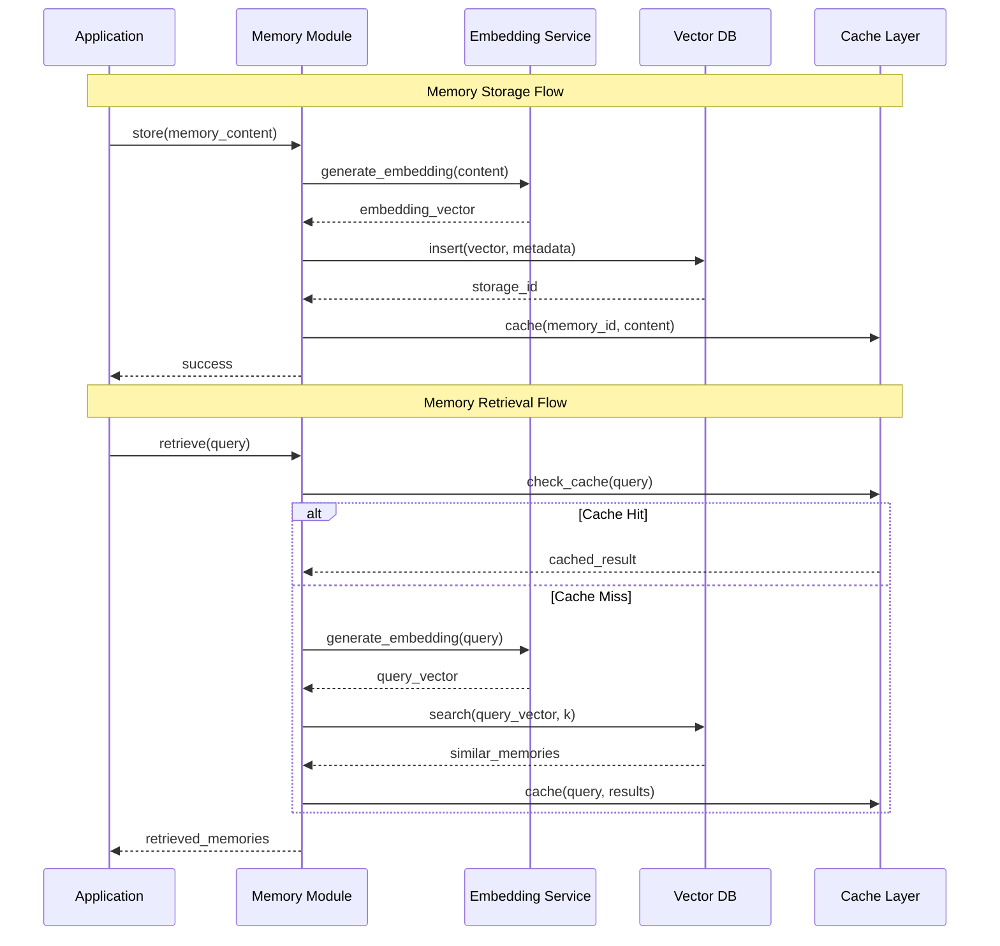

### AtomSpace Pattern Matching Flow

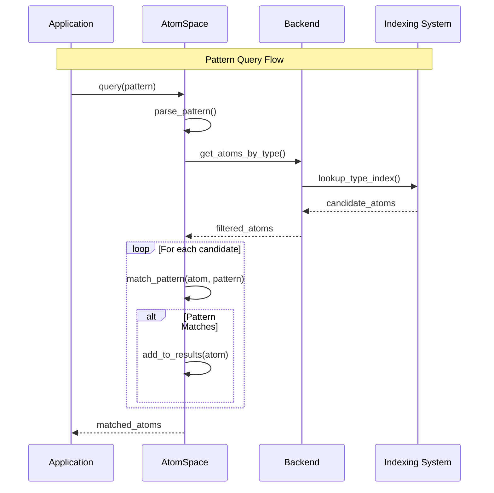

## System Invariants and Constraints

### Resource Management

- **Cognitive Budget**: Total available computational resources tracked and allocated
- **Memory Capacity**: Fixed capacity with intelligent forgetting mechanisms
- **Attention Budget**: Limited attention resources distributed across modalities
- **Goal Hierarchy Depth**: Maximum depth of 5 levels for goal decomposition

### Performance Characteristics

- **Cognitive Cycle Time**: < 10ms per cycle target
- **Memory Retrieval**: O(log n) with indexing, O(1) with caching
- **Pattern Matching**: O(n*m) where n = atoms, m = pattern complexity
- **Learning Update**: Batch size 32, every 10 experiences minimum

### Data Integrity

- **Truth Value Range**: [0.0, 1.0] for both strength and confidence
- **Attention Value**: STI/LTI unbounded, VLTI boolean flag
- **Goal Completion**: [0.0, 1.0] progress tracking
- **Reward Signal**: Unbounded but typically normalized to [-1.0, 1.0]

## Deployment Architecture

### Single Node Deployment

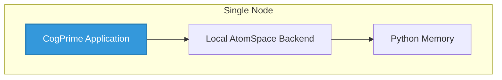

### Distributed Deployment

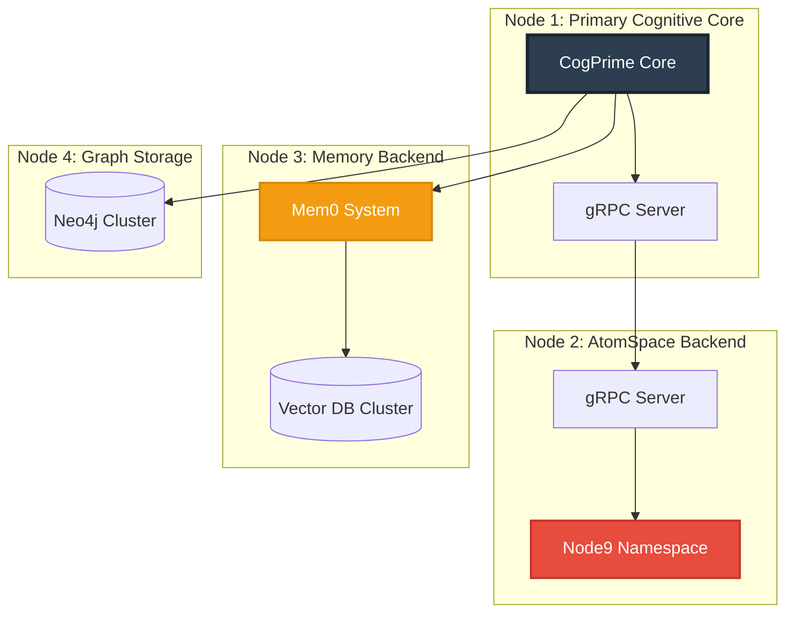

## Security and Error Handling

### Authentication Flow

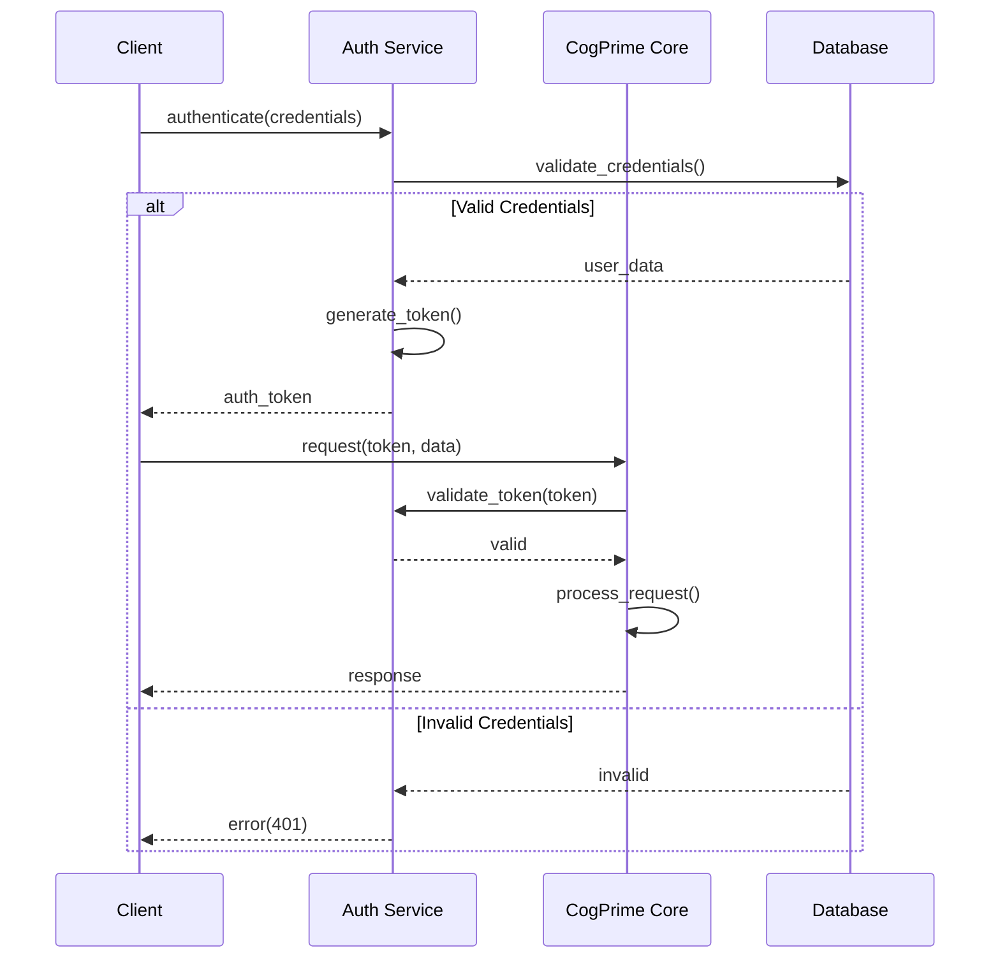

### Error Recovery Mechanisms

1. **Experience Buffer Overflow**: Least important experience eviction
2. **Memory Consolidation**: Automatic merging of similar memories at 70% similarity threshold
3. **Backend Failure**: Automatic fallback to local backend
4. **Pattern Match Timeout**: Result truncation after 5 seconds
5. **Learning Divergence**: Gradient clipping and learning rate adjustment

## Performance Metrics and Monitoring

### Key Performance Indicators

- **Cognitive Cycle Throughput**: Cycles per second
- **Memory Efficiency**: Storage reduction from consolidation
- **Attention Dynamics**: Entropy and stability metrics
- **Pattern Recognition Confidence**: Mean confidence across thought patterns
- **Goal Completion Rate**: Completed goals / total goals
- **Resource Utilization**: Used resources / total available resources
- **Learning Progress**: Q-value improvement over time
- **Integration Quality**: Cross-modal fusion effectiveness

## Conclusion

CogPrime represents a sophisticated multi-layered cognitive architecture that combines:

1. **Modular cognitive components** (Perception, Reasoning, Action, Learning)
2. **Flexible knowledge representation** (AtomSpace with multiple backends)
3. **Advanced memory systems** (Episodic memory with consolidation)
4. **Distributed computing capabilities** (node9, gRPC)
5. **Extensive external integrations** (Vector DBs, Graph DBs, LLMs)

The architecture is designed for scalability, extensibility, and rigorous cognitive modeling based on established AGI principles and cognitive science frameworks.
